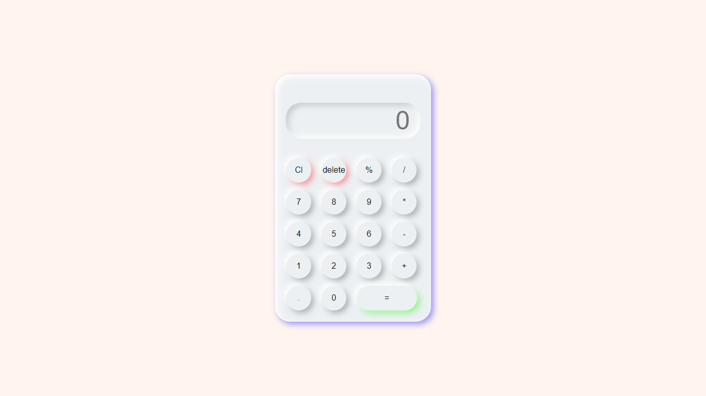

# Calculator-Website
A simple Calculator for general purposes.

### Why is it used 
- - -
Its useful for simple calculations.

### Features
- - -
<ol>
  <li>Add</li>
  <li>Substract</li>  
  <li>Divide</li>  
  <li>Multiply</li>  
  <li>Modulus</li>
</ol>
  
### Build With
- - -
<ul>
  <li>HTML</li>
  <li>CSS</li>  
  <li>JAVASCRIPT</li>  
</ul>

### How to Run ?
- - -

To run my application you simply need to clone the project and run the html file.

### Screenshot
- - -

